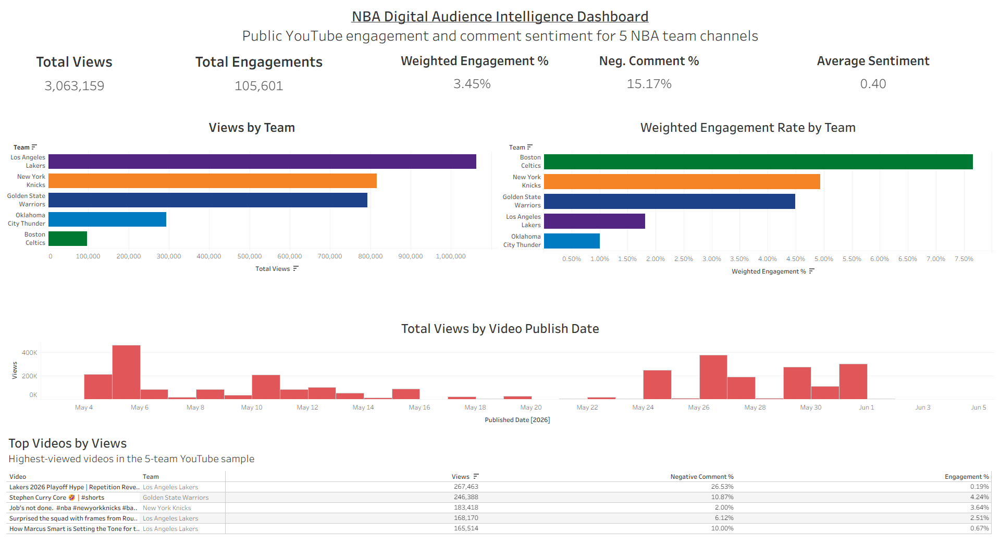
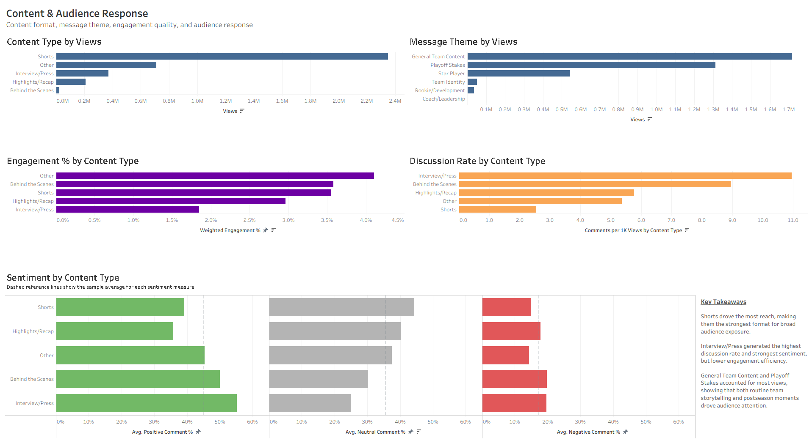
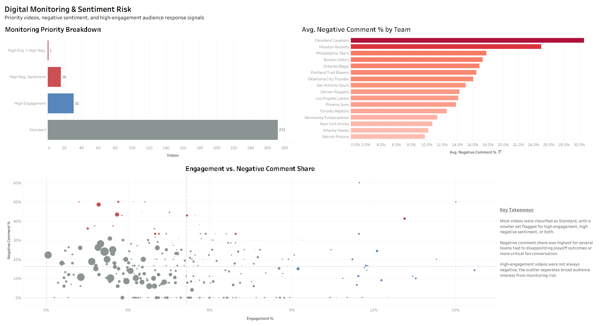

# NBA Playoff Digital Audience Intelligence Dashboard

This project analyzes public YouTube engagement and comment sentiment across the 16 NBA playoff team channels during the 2026 playoff window. The dashboard evaluates content performance, audience response, and digital monitoring signals around high-stakes postseason content.

The workflow uses R and the YouTube Data API to collect public video and comment data, sentiment analysis to convert unstructured audience text into structured fields, SQL to query KPI summaries, and Tableau to build stakeholder-facing dashboards.

**Tableau Public Dashboard:** https://public.tableau.com/app/profile/caleb.ramsey/viz/NBAPlayoffDigitalAudienceIntelligenceDashboard/DigitalMonitoringSentimentRisk

## Project Objective

The goal of this project is to translate public sports digital engagement data into a business intelligence workflow that could support a content, fan engagement, marketing, or digital monitoring team.

The project focuses on three core questions:

* Which content formats generate the most reach and engagement?
* Which message themes and video types generate stronger audience response?
* Which videos may require monitoring because of elevated negative sentiment or high-engagement audience reaction?

## Dashboard Pages

### Executive Overview

Provides a high-level summary of total views, total engagements, weighted engagement rate, negative comment share, average sentiment, team-level reach, engagement efficiency, and publishing trends.



### Content & Audience Response

Compares content type, message theme, discussion rate, engagement quality, and sentiment mix to identify which formats and storylines appear most effective.



### Digital Monitoring & Sentiment Risk

Flags videos with high engagement, high negative sentiment, or both. This page is designed as a digital monitoring workflow for identifying videos that may require closer review.



## Data Sources

* Public YouTube video metadata from official NBA team channels
* Public YouTube comment samples from collected videos
* 2026 NBA playoff team sample:

  * Atlanta Hawks
  * Boston Celtics
  * Cleveland Cavaliers
  * Denver Nuggets
  * Detroit Pistons
  * Houston Rockets
  * Los Angeles Lakers
  * Minnesota Timberwolves
  * New York Knicks
  * Oklahoma City Thunder
  * Orlando Magic
  * Philadelphia 76ers
  * Phoenix Suns
  * Portland Trail Blazers
  * San Antonio Spurs
  * Toronto Raptors

The current version uses a 16-team playoff sample rather than all 30 NBA teams. Each team was capped at 20 collected videos for a balanced dashboard sample.

## Tools Used

* R
* YouTube Data API
* SQL / SQLite
* Tableau Public
* GitHub
* Sentiment analysis with R

## Workflow

1. Collected recent video metadata from official NBA team YouTube channels.
2. Pulled video-level statistics including views, likes, comments, and duration.
3. Collected sampled public comments for each video.
4. Applied lexicon-based sentiment analysis to classify comments as positive, neutral, or negative.
5. Aggregated comment sentiment to the video level.
6. Created engagement, discussion, content type, message theme, and monitoring priority fields.
7. Loaded the cleaned dataset into SQLite.
8. Wrote SQL queries for executive KPIs, team performance, content analysis, sentiment summaries, and monitoring priorities.
9. Built Tableau dashboards for stakeholder-facing analysis.

## Key Metrics

* Total Views
* Total Engagements
* Weighted Engagement Rate
* Comments per 1K Views
* Average Comment Sentiment
* Positive Comment %
* Neutral Comment %
* Negative Comment %
* Monitoring Priority

Weighted engagement rate is calculated as:

```sql
SUM(engagement_count) * 1.0 / SUM(view_count)
```

This gives more weight to higher-view videos when summarizing team or content-level performance.

## Monitoring Priority Logic

Videos were assigned a monitoring priority based on engagement and negative sentiment signals.

* `High Engagement`: Videos at or above the 90th percentile for engagement rate.
* `High Negative Sentiment`: Videos at or above the 90th percentile for negative comment share among videos with enough sampled comments.
* `High Engagement / High Negative Sentiment`: Videos meeting both conditions.
* `Standard`: Videos not meeting either threshold.

The sentiment-risk logic uses a minimum comment threshold to avoid overreacting to videos with very small comment samples.

## Key Findings

* Shorts drove the most reach, making them the strongest format for broad audience exposure.
* Interview/Press content generated the highest discussion rate and strongest average sentiment, but lower engagement efficiency.
* General Team Content and Playoff Stakes accounted for most views, showing that both routine team storytelling and postseason moments drove audience attention.
* Most videos were classified as Standard in the monitoring workflow, with a smaller subset flagged for high engagement, high negative sentiment, or both.
* Negative comment share was highest for several teams tied to disappointing playoff outcomes or more critical postseason fan conversation.
* High-engagement videos were not always negative; the monitoring scatterplot helps separate broad audience interest from sentiment risk.

## SQL Outputs

The SQL workflow includes:

* Practice queries for basic SQL learning
* Business-facing analysis queries
* Tableau export queries
* Exported CSV summaries for executive, team, content, and monitoring views

Key SQL files:

* `sql/00_sql_practice_queries.sql`
* `sql/01_analysis_queries.sql`
* `sql/02_tableau_export_queries.sql`

## Repository Structure

```text
nba-digital-audience-intelligence/
├── data/
│   ├── raw/
│   ├── processed/
│   └── exports/
├── docs/
├── scripts/
├── sql/
├── tableau/
│   ├── dashboard_screenshots/
│   └── dashboard_workbooks/
├── outputs/
└── README.md
```

## File Guide

* `scripts/01_collect_youtube_data.R`: Collects YouTube video metadata and statistics.
* `scripts/02_sentiment_analysis.R`: Pulls sampled comments and applies sentiment analysis.
* `scripts/03_clean_feature_engineer.R`: Creates cleaned video-level metrics and monitoring fields.
* `scripts/04_build_sql_database.R`: Loads the cleaned dataset into SQLite.
* `scripts/06_run_analysis_queries.R`: Runs selected SQL queries and exports summary tables.
* `sql/00_sql_practice_queries.sql`: Practice SQL queries used for learning and validation.
* `sql/01_analysis_queries.sql`: Main business-facing SQL queries.
* `sql/02_tableau_export_queries.sql`: SQL queries structured for Tableau-ready outputs.
* `data/exports/tableau_video_level_export.csv`: Primary Tableau data source.
* `tableau/dashboard_screenshots/`: Dashboard images for portfolio review.
* `tableau/dashboard_workbooks/`: Tableau workbook files.

## Limitations

* The current version uses a 2026 NBA playoff team sample rather than all 30 NBA teams.
* Each team was capped at 20 videos, so the dashboard is a balanced sample rather than a complete archive of every team upload.
* Comment sentiment is estimated using lexicon-based sentiment analysis and should be interpreted directionally.
* YouTube comment samples may not represent the full audience response for each video.
* Some YouTube like counts may be unavailable through the API, which can affect engagement calculations.
* Content type and message theme classifications are rule-based and may require manual refinement in future versions.
* Team-level totals can be influenced by playoff timing, opponent interest, player storylines, and how frequently each team posted during the sampled window.

## Future Improvements

* Expand the dataset to all 30 NBA team YouTube channels.
* Increase the number of videos and comments collected per team.
* Improve content classification using more detailed text rules or manual validation.
* Add platform comparisons across YouTube, Reddit, TikTok, Instagram, or X.
* Build a formal data dictionary and methodology page.
* Add automated refresh scripts for repeatable reporting.

## Project Purpose

This project was built to demonstrate practical BI and data analyst skills, including API data collection, data cleaning, SQL querying, KPI development, Tableau dashboarding, and stakeholder communication.
